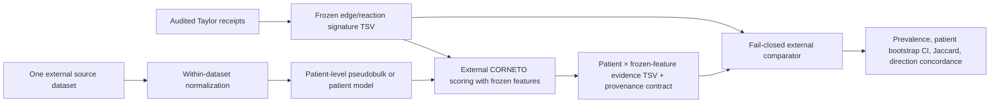

# External CORNETO validation contract

This layer compares a prespecified Taylor-OCM CORNETO signature with external
HGSOC evidence. It is a post-processing comparator, not a solver runner. It
does not accept expression matrices and it does not submit Slurm jobs.

## Dependency graph



Repeat the `E` through `G` branch independently for every source dataset and
biological stratum. Raw TPM/count matrices from different studies must never be
concatenated. For single-cell sources, cells contribute only to a
`patient_id × cell_type × site` pseudobulk; cells are not replicates.

## Frozen signature TSV

Required columns are:

```text
feature_type  feature_id  expected_direction
edge          TP53|MYC|+  1
reaction      MAR04358     0
```

`feature_type` is `edge` or `reaction`. Direction is `-1`, `0`, or `1`; zero
means the signature is direction-agnostic for that feature. Freeze and hash
this file before any external scoring. Do not select features because they
separate an external label.

## Patient evidence TSV

Each comparison group has a complete rectangular grid with exactly one row per
`patient_id × frozen feature`:

```text
patient_id  feature_type  feature_id  selected  direction
P001        edge          TP53|MYC|+  1         1
P001        reaction      MAR04358     0         0
```

`selected` is `0/1` or `false/true`. An unselected feature must have direction
zero. A selected feature whose frozen expected direction is nonzero must have a
nonzero inferred direction. Missing features, duplicate patient-feature rows,
or features absent from the frozen signature invalidate the group.

## Provenance contract JSON

Each group must provide an `external_corneto_group.v1` JSON object. The hashes
bind it to the evidence and frozen signature. Minimal example:

```json
{
  "schema_version": "external_corneto_group.v1",
  "status": "completed",
  "group_label": "GSE189955_malignant_primary",
  "source_accession": "GSE189955",
  "evidence_sha256": "<sha256>",
  "signature_sha256": "<sha256>",
  "patient_count": 8,
  "analysis_unit": "patient_pseudobulk",
  "normalization": {
    "performed_within_dataset": true,
    "pooled_raw_expression": false,
    "input_scale": "network_selection"
  },
  "independence": {
    "cells_as_replicates": false,
    "patient_id_column": "patient_id"
  },
  "inference": {
    "signature_frozen_before_external_scoring": true,
    "feature_selection_using_external_labels": false
  }
}
```

Allowed analysis units are `patient_pseudobulk`, `patient_model`, and
`patient_tissue`. Allowed input scales are `standardized_rank`,
`activity_score`, `network_selection`, and `flux_direction`.

## Executable comparator

```bash
python scripts/compare_external_corneto.py \
  --signature results/frozen_taylor_signature.tsv \
  --group GSE189955_malignant_primary=results/gse189955_primary.tsv,results/gse189955_primary.contract.json \
  --group GSE189955_normal_ft=results/gse189955_ft.tsv,results/gse189955_ft.contract.json \
  --bootstrap-iterations 2000 \
  --seed 1729 \
  --prevalence-threshold 0.5 \
  --output results/gse189955_external_comparison.json
```

The comparator reports per-feature patient prevalence with percentile
bootstrap confidence intervals, consensus-set Jaccard, direction concordance,
and matched-patient Jaccard when patient IDs occur in both groups. The output
is descriptive external concordance: it is not measured flux, causal evidence,
or drug-response validation.
