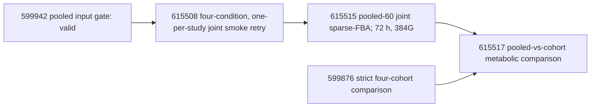
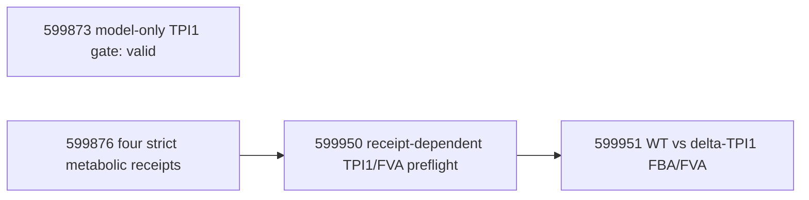

# HGSOC CORNETO research status and dependency register

Last operational update: 2026-08-12 20:52 BST (22:52 EEST). This file is the project-level source of
truth for scientific scope, completed evidence, queued analyses, failed
attempts, dependencies, and claim limits. Slurm `COMPLETED` is never sufficient
on its own: a result is scientifically complete only when its output receipt
passes the corresponding content validator.

## Central scientific question

> Do HGSOC OCMs contain metabolic and regulatory states that reproduce across
> cohorts, remain robust to repeated patients and modelling choices, are
> enriched relative to stroma/reference samples, and receive support from
> external mechanistic evidence?

The primary evidence unit is the 60 primary HGSOC tumour OCMs. They represent
52 patients and four studies, so analyses must distinguish OCM-level,
patient-balanced, cohort-stratified, and pooled results. The remaining public
RNA runs are reference/QC data and are not silently merged into the primary
cohort.

## Frozen sample universe

| Study | All RNA runs | Primary HGSOC tumour OCMs | Principal reference runs |
|---|---:|---:|---|
| E-MTAB-7223 | 36 | 9 | 16 stroma, 2 cell-line controls, non-HGSOC/ambiguous and other exclusions |
| E-MTAB-10801 | 36 | 13 | 17 stroma and 6 non-HGSOC |
| E-MTAB-11000 | 12 | 11 | 1 non-primary tumour run |
| E-MTAB-14568 | 33 | 27 | 6 non-HGSOC |
| **Total** | **117** | **60 OCM / 52 patients** | **57 reference/excluded runs** |

Reference categories overlap scientific roles and must be analysed separately:
stroma is the strongest formal secondary contrast; confirmed non-HGSOC is an
exploratory histology contrast; ambiguous samples are not controls; two
cell-line controls are descriptive QC only; later-passage and non-Tighe samples
support stability or response-blind replication rather than population-level
inference.

## Analysis hierarchy and claim limits

| Evidence tier | Analyses | Permitted interpretation |
|---|---|---|
| Primary | Four cohort-specific primary-HGSOC metabolic and regulatory models; cross-cohort recurrence | Reproducible model-predicted metabolic/regulatory state |
| Robustness | pooled-60, patient-balanced-52, lambda, PKN, NMF rank, alternative optima | Sensitivity to modelling and repeated patients |
| Reference | tumour vs stroma; confirmed HGSOC vs confirmed non-HGSOC; cell-line and passage QC | Enrichment/shared core, not absolute presence/absence |
| Mechanistic | Meeson/TPI1, WT vs delta-TPI1, FVA, order sensitivity | Model/known-mechanism concordance, not drug-response validation |
| Phenotype-linked | exact AUC, raw GI50, cumulative exposure, grouped CV | **Blocked until exact phenotype tables pass intake QC** |

All expression-derived fluxes are model-predicted feasible flux states, not
measured flux. Regulatory/NMF/metabolic agreement derived from the same RNA
profiles is internal consistency, not independent validation.

## Completed and auditable results

### RNA and pooled-input gates

- All four RNA studies were downloaded, quantified, and aggregated with strict
  run/receipt checks.
- Pooled primary expression contains 60 runs, 60 OCMs, 52 patients and 60,609
  genes; study counts are 9/13/11/27.
- Pooled metabolic input gate job **599942** completed and validated matrix,
  manifest, Human-GEM, and all SHA256 provenance. Receipt:
  `data/processed/corneto/pooled_primary_60/metabolic_input_gate.json`.

### NMF

- Primary cohort and pooled NMF jobs **591326-591328** completed.
- Pooled rank-3 clusters contain 23/20/17 samples; cophenetic correlation is
  0.939 and silhouette is 0.770. Rank 2 is more stable (0.972/0.899), so rank 3
  is a frozen comparability benchmark rather than a uniquely optimal rank.
- Pooled-vs-cohort rank-3 ARI is 0.723 (7223), 0.529 (10801), 0.377 (11000),
  and 0.569 (14568); mapped assignment agreement is 0.889/0.846/0.727/0.741.
- Study association with pooled state was not statistically clear
  (chi-square p=0.207, Cramer's V=0.265), but study-aware sensitivity remains
  required.
- Patient-balanced-52 rank-3 comparison completed: mapped agreement 0.942,
  ARI 0.842 and NMI 0.825. This supports robustness to repeated-patient
  weighting, but it is only one deterministic patient-balanced selection.

### Regulatory CORNETO

- True multi-condition normalized-lambda grid and retries completed; the final
  summary contains 45/45 pooled/cohort receipts across nine nominal lambdas.
- Patient-balanced regulatory analysis retained similar networks on the 52
  common patients: pooled/balanced union Jaccard 0.890 and mean per-sample
  Jaccard 0.899.
- Narrow-vs-richer PKN sensitivity completed. Pooled union Jaccard was 0.202
  and mean sample Jaccard 0.108; cohort union Jaccards were approximately
  0.108-0.143. Network conclusions are therefore materially PKN-sensitive and
  must be reported as stable cores plus uncertain alternatives.
- Regulatory longitudinal summary covered 60 runs and eight within-family
  transitions. It is response-blind; acquired-resistance interpretation still
  requires exact exposure and phenotype.
- Regulatory x NMF state integration completed for all four cohorts. It is a
  descriptive same-input integration, not independent validation or subtype
  discovery.
- E-MTAB-14568 regulatory alternative-optima ensemble and serial repairs
  completed. The solution ensemble, rather than a single sparse optimum, is the
  appropriate evidence object.

### Human-GEM and TPI1 model gate

- Public Meeson TPI1 table audit job **591424** completed; this is an audit of
  published/model values rather than an OCM-specific knockout result.
- Independent model-level TPI1 gate job **599873** completed and is valid:
  Human-GEM contains 13,096 reactions and 3,628 genes; TPI1 maps to
  `ENSG00000111669` and reaction `HMR_4391`; no solver was called. Receipt:
  `data/processed/corneto/tpi1_model_gate.json`.
- Obsolete pending job **591049** was cancelled before starting because it
  would have overwritten that same receipt after the original baselines. Its
  roles are now separated into 599873 (model only) and 599950 (strict
  receipt-dependent preflight).

## Terminal-job audit and retry lineage

This table records final evidence rather than counting every diagnostic Slurm
attempt as an independent experiment.

| Analysis family | Final evidence state | Failed/superseded attempts and disposition |
|---|---|---|
| RNA quantification and aggregation | Four aggregation receipts are `completed`: 36/36/12/33 runs, each with 60,609 genes and 227,462 transcripts | Earlier per-run download, OOM and aggregation failures were repaired; no RNA retry remains |
| Primary and pooled NMF | 591326-591328 completed; patient-balanced NMF/compare 592020 and 592094 completed | 592083 comparison failed and was replaced by 592094 |
| True multi-condition regulatory lambda grid | Final 591593 retry and 591595 summary completed; 45/45 receipts across pooled plus four cohorts and nine lambdas validate | Initial 591416 tasks hit Gurobi session limits; failed artifacts are preserved and were replaced only for affected labels |
| Regulatory alternative optima | Final 591572 summary validates 27 E-MTAB-14568 samples: 26 nonempty completed and one blocked zero-edge sample | Six initial session-cap errors were rerun serially by 591569 |
| Richer-PKN sensitivity | 592021/592023/grid jobs and comparison 592118 completed | No unresolved retry |
| Patient-balanced regulatory sensitivity | 592143 and 592149 completed on 52 common patients | No unresolved retry |
| Longitudinal regulatory summary | 592019 completed: 60 runs and eight response-blind within-family comparisons | Earlier prototype 588876 failed and was replaced by 588883/592019 lineage |
| Regulatory x NMF integration | Final v4 job 592053 completed with full 9/13/11/27 coverage; 576 BH-adjusted edge-state tests yielded no q<0.05 findings | 592018, 592040 and 592046 failed during interface/path corrections and were superseded by 592053 |
| Meeson public evidence | 591424 completed; toy joint/order/global-retention receipts validate algorithmic behavior | Cohort-specific order/ensemble jobs for 7223/10801/11000 were dependency-cancelled and have not yet been reattached to valid metabolic retries; 14568 tasks remain pending |
| Metabolic growth-fraction sensitivity | No valid receipt from 588286-588289 | All four reached the original 4 h limit; no retry is queued before primary baselines validate |

For the normalized regulatory grid, solver completion at high lambda is not a
positive network finding: pooled networks become empty at nominal lambda 0.05
and above, and most cohort networks also collapse at 0.05-0.1. This is evidence
of over-regularisation under the current scaling, not evidence of biological
absence. At lambda 0.001, pooled-vs-merged-cohort edge-union Jaccard is 0.746;
at lambda 0.01 it falls to 0.286. These remain response-blind technical results.

## Metabolic baseline: active, failed, and queued

Primary settings are frozen: Human-GEM v1.4.1, raw TPM transformed with
`log1p`, primary tumour only, candidate budget 25, growth fraction 0.9,
independent lambda 0.1, joint lambda 1.0, and explicit Gurobi without fallback.

| Study | Original job | State at update | Conditional/new retry | Resources |
|---|---:|---|---:|---|
| E-MTAB-7223 | 588250 | `TIMEOUT` at the 24 h limit; no valid final receipt | **600005**, running for about 4 h with no startup error or receipt yet | 72 h, 128G, 8 CPU |
| E-MTAB-10801 | 588251 | Failed: genuine 64G OOM | **600004**, running for about 12 h with no startup error or receipt yet | 72 h, 196G, 8 CPU |
| E-MTAB-11000 | 588252 | `TIMEOUT` at the 24 h limit; no valid final receipt | **600006**, running for about 4 h with no startup error or receipt yet | 72 h, 128G, 8 CPU |
| E-MTAB-14568 | 588253 | Running for about 28 h of a 72 h limit; no final receipt yet | **600007**, pending `afterany:588253`, skip if the original receipt validates | 72 h, 196G, 8 CPU |

At the 22:42 EEST inspection, solver-step peak RSS was about 28.8 GiB for
588253, 17.3 GiB for 600004, 10.9 GiB for 600005, and 10.0 GiB for 600006.
CPU time and disk I/O continued to increase, and active logs showed the expected
Human-GEM LP setup/solve work without a new OOM, license-session-cap error, or
solver exception. The external-compartment auto-detection warning remains a
model-boundary caveat to audit after completion, but is not by itself evidence
of a failed solve. No final cohort/retry metabolic receipt existed at this
checkpoint, so none of the running jobs is yet a scientific result.

Superseded startup attempts **599836** and **599943** failed in seconds with
exit 127 because `module` is unavailable in direct non-login sbatch scripts;
they did not call Gurobi or create scientific output. Pending broken retries
599837-599839 were cancelled before starting and replaced by 600005-600007.

Immediate availability audit **599874** completed with status `incomplete`
and correctly recorded 0/4 final receipts; this is expected, not a scientific
failure. Final availability audit **599875** and strict four-cohort comparison
**599876** remain pending on `afterany:600004,600005,600006,600007`; their
receipt-producing successors are therefore not yet eligible. The strict
comparison will fail closed if any receipt is missing or violates the frozen
contract. Job **599950** remains pending on `afterok:599876`, and **599951**
remains pending on `afterok:599950`.

## Pooled metabolic joint analysis

This analysis is intentionally joint-only: the four cohort jobs provide
independent/cohort evidence, while repeating 60 independent MILPs inside one
72-hour pooled job would waste completed work and erase progress on timeout.

The smoke uses one primary OCM from each study, candidate budget 25, growth
fraction 0.9, joint lambda 1.0 and Gurobi. The pooled-60 job starts only if the
smoke succeeds, but neither depends on the cohort baselines. Original smoke
**600008** reached its 12 h wall-time after four expected Human-GEM LP reads.
It used only about 7.1 GiB peak RSS and showed no OOM, license-session-cap, or
Python/solver exception, but produced no receipt; it is therefore an
operational timeout and not a scientific result. Slurm automatically cancelled
never-started successors **600009** and **600010** when the `afterok`
dependency failed. One scientifically identical smoke retry, **615508**, was
submitted with the time limit extended to 36 h and the same 128G request; it
was running normally at this checkpoint. Replacement full job **615515** waits
on `afterok:615508`, and replacement comparator **615517** waits on both
`afterok:599876` and `afterok:615515`. No duplicate pooled solver job was
submitted and no pooled result may be interpreted before its receipt validates.

## TPI1/FVA and Meeson dependency chain

Existing Meeson order-sensitivity and ensemble jobs are attached to individual
original cohort jobs. If an original times out but its conditional retry
succeeds, the corresponding cancelled downstream task must be resubmitted
against the valid retry receipt. No result should be inferred from dependency
state alone.

## Reference comparisons still to implement/run

1. **Tumour vs stroma (formal secondary analysis).** Analyse E-MTAB-7223 and
   E-MTAB-10801 separately, use paired contrasts where identity permits, then
   meta-analyse prevalence/effect sizes. Report tumour-enriched,
   stroma-enriched, shared stable core, study-specific and unresolved features.
2. **HGSOC vs confirmed non-HGSOC (exploratory).** Confirm histology first;
   ambiguous samples remain a separate category.
3. **Tumour vs two cell-line controls (descriptive QC).** No population-level
   p-values or claims are justified.
4. **Passage/non-Tighe stability.** Use paired/case-level expression, NMF,
   regulatory and metabolic retention; do not attach drug-response labels.
5. For every network contrast, replace simple set subtraction with prevalence
   difference, patient/study-aware uncertainty, alternative-optima frequency,
   lambda/PKN sensitivity and multiplicity control.

## Missing data and blocked claims

Exact OCM-linked AUC, raw GI50 units, cumulative treatment exposure and their
primary provenance are not yet available in a validated intake table. Until
they pass the frozen phenotype gate, the project cannot claim Taxol response,
intrinsic resistance, acquired resistance prediction, or response-model
accuracy. `chemo_naive_at_biopsy` is not an acceptable replacement for exact
cumulative exposure.

## Operational update rules

1. Preserve failed logs and receipts; retries write only when the canonical
   result is absent, and existing receipts must validate before a retry skips.
2. Use `afterany` for audit jobs so failures remain visible; use `afterok` plus
   internal receipt validation for scientific downstream jobs.
3. Record job ID, exact command, model/input hashes, sample contract, solver,
   lambda, candidate budget, objective and claim limit in every receipt.
4. Do not select lambda, NMF rank, PKN, or candidate budget based on the most
   attractive biological story. Primary settings and sensitivity grids are
   frozen before outcome analysis.
5. Update this register whenever a job becomes terminal or a validated receipt
   changes the evidence state.

## Recurring monitor

The Codex heartbeat **HGSOC CORNETO Roihu pipeline monitor** is attached to this
conversation and runs every 30 minutes. It has no explicit model or reasoning
override, so it follows the current conversation/default settings and does not
create a separate standalone monitoring conversation. This cadence is deliberate:

- Slurm dependencies already launch valid successors, so minute-scale polling
  would not accelerate the pipeline.
- Thirty minutes is short enough to catch smoke/startup, license-session,
  timeout, and receipt failures while 588250/588252 approach their 24-hour
  limits.
- It is long enough to avoid repeatedly querying multi-hour Gurobi jobs whose
  logs are sparse during branch-and-bound.

Each run checks scheduler state, resource use, log tails, and receipt JSON. It
may make only deterministic in-scope repairs: no duplicate submissions, no
cancellation of healthy jobs, no scientific-parameter changes, and no result
claim without a valid receipt. OOM/TIMEOUT retries preserve parameters and
increase only justified resources; Gurobi session-cap failures wait until fewer
than eight sessions are active. Meaningful state changes are written here and
pushed to the delivery branch; unchanged checks produce only a compact
checkpoint. After all cohort, pooled, comparison, and TPI1/FVA outputs are
terminal and audited, the monitor reports completion and should be paused.
