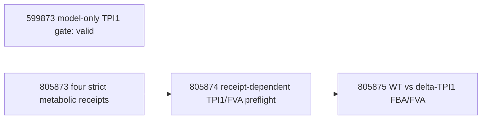

# HGSOC CORNETO 研究状态与依赖登记（中文对应版）

最后运行更新：2026-08-24 10:09 BST（12:09 EEST）。本文件与
`docs/hgsoc_corneto_research_status.md` 对应，记录研究范围、已完成证据、排队分析、失败尝试、依赖关系与可声明范围。
仅有 Slurm `COMPLETED` 不足以证明科学分析完成；只有输出 `receipt` 通过相应内容验证后，结果才算科学上完成。

## 核心科学问题（Central scientific question）

> HGSOC OCM 中是否存在跨 cohort 可复现、对重复患者和 modelling choices
> 稳健的 metabolic 与 regulatory states；这些状态相对于 stroma/reference
> samples 是否富集，并能否得到外部 mechanistic evidence 支持？

主要证据单位是 60 个 primary HGSOC tumour OCM。它们来自 52 位患者和四个
study，因此所有分析都必须区分 OCM-level、patient-balanced、cohort-stratified
和 pooled 结果。其余公开 RNA runs 是 reference/QC 数据，不得静默合并进 primary cohort。

## 冻结的样本范围（Frozen sample universe）

| Study | 全部 RNA runs | Primary HGSOC tumour OCM | 主要 reference runs |
|---|---:|---:|---|
| E-MTAB-7223 | 36 | 9 | 16 stroma、2 cell-line controls、non-HGSOC/ambiguous 及其他排除项 |
| E-MTAB-10801 | 36 | 13 | 17 stroma、6 non-HGSOC |
| E-MTAB-11000 | 12 | 11 | 1 个 non-primary tumour run |
| E-MTAB-14568 | 33 | 27 | 6 non-HGSOC |
| **合计** | **117** | **60 OCM / 52 patients** | **57 reference/excluded runs** |

reference categories 具有不同科学角色，必须分开分析：stroma 是最强的正式
secondary contrast；confirmed non-HGSOC 是 exploratory histology contrast；
ambiguous samples 不是 controls；两个 cell-line controls 只能用于 descriptive
QC；later-passage 与 non-Tighe samples 用于 stability 或 response-blind replication，
不能用于 population-level inference。

## 分析层级与 claim limits

| Evidence tier | 分析 | 允许的解释 |
|---|---|---|
| Primary | 四个 cohort-specific primary-HGSOC metabolic/regulatory models；cross-cohort recurrence | 可复现的 model-predicted metabolic/regulatory state |
| Robustness | pooled-60、patient-balanced-52、lambda、PKN、NMF rank、alternative optima | 对 modelling choices 和重复患者的敏感性 |
| Reference | tumour vs stroma；confirmed HGSOC vs confirmed non-HGSOC；cell-line/passage QC | enrichment/shared core，不能声称 absolute presence/absence |
| Mechanistic | Meeson/TPI1、WT vs delta-TPI1、FVA、order sensitivity | 与模型/已知机制的一致性，不是 drug-response validation |
| Phenotype-linked | exact AUC、raw GI50、cumulative exposure、grouped CV | **在 exact phenotype tables 通过 intake QC 前保持 blocked** |

所有 expression-derived flux 都是模型预测的 feasible flux states，不是 measured
flux。由同一 RNA profiles 得到的 regulatory/NMF/metabolic agreement 是 internal
consistency，不是 independent validation。

## 已完成且可审计的结果（Completed and auditable results）

### RNA 与 pooled-input gates

- 四个 RNA studies 均已下载、定量并聚合，且通过严格 run/receipt 检查。
- Pooled primary expression 包含 60 runs、60 OCM、52 patients 和 60,609 genes；
  study counts 为 9/13/11/27。
- Pooled metabolic input gate job **599942** 已完成，验证 matrix、manifest、
  Human-GEM 和全部 SHA256 provenance。Receipt：
  `data/processed/corneto/pooled_primary_60/metabolic_input_gate.json`。

### NMF

- Primary cohort 与 pooled NMF jobs **591326-591328** 已完成。
- Pooled rank-3 clusters 包含 23/20/17 samples；cophenetic correlation 为
  0.939，silhouette 为 0.770。Rank 2 更稳定（0.972/0.899），因此 rank 3
  是冻结的 comparability benchmark，不是唯一最优 rank。
- Pooled-vs-cohort rank-3 ARI：7223 为 0.723、10801 为 0.529、11000 为
  0.377、14568 为 0.569；mapped assignment agreement 为 0.889/0.846/0.727/0.741。
- pooled state 与 study 的关联未达到清晰统计证据（chi-square p=0.207、
  Cramer's V=0.265），但仍需要 study-aware sensitivity。
- Patient-balanced-52 rank-3 comparison 已完成：mapped agreement 0.942、
  ARI 0.842、NMI 0.825。这支持对 repeated-patient weighting 的稳健性，但仅是一次 deterministic patient-balanced selection。

### Regulatory CORNETO

- True multi-condition normalized-lambda grid 与 retries 已完成；final summary
  包含九个 nominal lambdas 下的 45/45 pooled/cohort receipts。
- Patient-balanced regulatory analysis 在 52 个共同患者上保留了相似网络：
  pooled/balanced union Jaccard 为 0.890，mean per-sample Jaccard 为 0.899。
- Narrow-vs-richer PKN sensitivity 已完成。Pooled union Jaccard 为 0.202，
  mean sample Jaccard 为 0.108；cohort union Jaccard 约为 0.108-0.143。因此
  network conclusions 明显受 PKN 影响，必须报告 stable cores 与 uncertain alternatives。
- Regulatory longitudinal summary 覆盖 60 runs 和八个 within-family transitions。
  这是 response-blind 分析；acquired-resistance 解释仍需 exact exposure 和 phenotype。
- Regulatory x NMF state integration 已覆盖四个 cohorts。它是基于相同 input 的
  descriptive integration，不是 independent validation，也不是 subtype discovery。
- E-MTAB-14568 regulatory alternative-optima ensemble 与 serial repairs 已完成。
  正确的证据对象是 solution ensemble，而不是单个 sparse optimum。

### Human-GEM 与 TPI1 model gate

- Public Meeson TPI1 table audit job **591424** 已完成；它审计 published/model
  values，不是 OCM-specific knockout result。
- Independent model-level TPI1 gate job **599873** 已完成且有效：Human-GEM
  含 13,096 reactions 和 3,628 genes；TPI1 映射到 `ENSG00000111669` 与 reaction
  `HMR_4391`；没有调用 solver。Receipt：
  `data/processed/corneto/tpi1_model_gate.json`。
- 过时的 pending job **591049** 在启动前已取消，因为它会在 original baselines
  之后覆盖同一 receipt。其职责现已拆分为 599873（model only）和 599950（strict
  receipt-dependent preflight）。

## 终态任务审计与 retry lineage

下表记录最终 evidence，而不是把每个诊断性 Slurm attempt 当成独立实验计数。

| Analysis family | 最终 evidence 状态 | 失败/被取代尝试及处理 |
|---|---|---|
| RNA quantification 与 aggregation | 四个 aggregation receipts 均为 `completed`：36/36/12/33 runs；每个均有 60,609 genes、227,462 transcripts | 早期逐-run download、OOM 与 aggregation failures 均已修复；没有剩余 RNA retry |
| Primary 与 pooled NMF | 591326-591328 已完成；patient-balanced NMF/compare 592020、592094 已完成 | 592083 comparison 失败，已由 592094 替代 |
| True multi-condition regulatory lambda grid | Final retry 591593 与 summary 591595 已完成；pooled + 四 cohorts、九个 lambdas 共 45/45 receipts 有效 | Initial 591416 tasks 遇到 Gurobi session limit；失败证据保留，仅重跑受影响 labels |
| Regulatory alternative optima | Final summary 591572 验证 E-MTAB-14568 全部 27 samples：26 个 nonempty completed、1 个 zero-edge blocked | 六个初始 session-cap errors 已由 591569 串行 retry |
| Richer-PKN sensitivity | 592021/592023/grid jobs 与 comparison 592118 均完成 | 无未解决 retry |
| Patient-balanced regulatory sensitivity | 592143 与 592149 在 52 common patients 上完成 | 无未解决 retry |
| Longitudinal regulatory summary | 592019 完成：60 runs、八个 response-blind within-family comparisons | 早期 prototype 588876 失败，已由 588883/592019 lineage 替代 |
| Regulatory x NMF integration | Final v4 job 592053 完成，覆盖 9/13/11/27；576 个 BH-adjusted edge-state tests 均无 q<0.05 finding | 592018、592040、592046 在 interface/path 修正阶段失败，已由 592053 替代 |
| Meeson public evidence | 591424 完成；toy joint/order/global-retention receipts 验证 algorithmic behavior | 7223/10801/11000 的 cohort-specific order/ensemble jobs 因 dependency 被取消，尚未重新绑定有效 metabolic retries；14568 tasks 仍 pending |
| Metabolic growth-fraction sensitivity | 588286-588289 没有有效 receipt | 四个任务均达到原 4 h limit；primary baselines 验证前不排 retry |

对 normalized regulatory grid 而言，高 lambda 下 solver completed 不等于正向 network
finding：pooled network 在 nominal lambda 0.05 及以上变为空，大部分 cohort network
也在 0.05-0.1 collapse。这是当前 scaling 下 over-regularisation 的证据，不是 biological
absence 的证据。lambda 0.001 时 pooled-vs-merged-cohort edge-union Jaccard 为 0.746；
lambda 0.01 时降至 0.286。这些仍是 response-blind technical results。

## Metabolic baseline：运行中、失败与排队任务

冻结的 primary settings：Human-GEM v1.4.1、raw TPM 经 `log1p` 转换、primary
tumour only、candidate budget 25、growth fraction 0.9、independent lambda 0.1、
joint lambda 1.0，以及不允许 fallback 的 explicit Gurobi。

所有 monolithic cohort attempts 均已终态，且都没有有效 final receipt。
588250/588252 与 600004/600005/600007 达到 wall-time limits；588251 是已确认的
64G OOM；588253 与 600006 失败但没有 canonical scientific receipt。后续的 11000
retry 727583 也达到 72 h。这证明只在最后写一次 JSON 的策略不适合本 MILP。

替代设计把每个 cohort 的 expression-derived bounds 与 objectives 冻结在
`checkpoint_b25/context.json`；一个 array task 只求解一个 independent OCM；全部
independent canonical receipts 成功后才求 joint cohort，最后组装
`full_direct_b25.json`。本次更新状态如下：

| Study | 必需 OCM receipts | 保留的健康 r4/legacy work | 已取消的排队中 64G tasks | 128G recovery array |
|---|---:|---|---|---:|
| E-MTAB-7223 | 9 | 805860 task 5 | 没有剩余 pending task | **834320**，`0-8%3`，等待805860全部 tasks |
| E-MTAB-10801 | 13 | 805861 tasks 0、1、5 | 805861 tasks 6-12 | **834321**，`0-12%3`，等待805861全部 tasks |
| E-MTAB-11000 | 11 | legacy 805003 task 0 | 805862 tasks 0-10 | **834323**，`0-10%3`，等待其它三个 r5 arrays 与805003 |
| E-MTAB-14568 | 27 | 805863 tasks 0、10、11 | 805863 task 8 与 tasks 12-26 | **834322**，`0-26%3`，等待805863全部 tasks |

00:24 EEST live check 时，六个24-hour legacy tasks 已运行13 h 13 min，72-hour
11000 task 已运行11 h 44 min。Solver-step CPU efficiency 约94-96%，disk counters
继续增加，peak RSS 为15.2-23.8 GiB，相对于64G request 没有 memory pressure。这支持
“仍在 active solving”，而不是 OOM 或 idle hang；但不能证明 feasibility、optimality 或
scientific correctness。这些 pre-instrumentation processes 没有 live Gurobi progress log，
也没有写 canonical/partial receipt、`.sol` 或 `.mst`，因此当前无法取得它们的 incumbent
与 gap。六个24-hour tasks 尚余约10 h 47 min，仍可能重复此前 timeout pattern。只有
instrumented r4/r5 jobs 会提供 live solver logs，以及在 internal limit/终态保证写出的
telemetry 和 partial receipt。

749576/749580/749584 的六个健康 RUNNING tasks 与健康的 805003_0 均未取消。
749576/749580/749584 的 tasks 0-1 此前已在 24 h timeout，且没有 independent
receipt。instrumented recovery 在运行前验证并跳过 context hash 一致的 canonical
receipt，因此 legacy task 若成功，其结果不会被重复计算。

Instrumented arrays 启动后，7223、10801 与14568 的多批 r4 elements 在原64G request
下通常运行1-9分钟即被 Slurm memory cgroup 终止。Python steps 被强制杀死前没有机会写
canonical 或 partial scientific receipt。12:09 EEST 时仍有7个健康的64G tasks 在运行；
这些任务被明确保留。所有仍在 pending 的64G tasks 已取消，包括尚未启动的整个805862
array。independent-job 默认内存已提高到128G，throttle 为3的 recovery arrays
**834320-834323** 已被 Slurm 接受。它们会验证并跳过 context/provenance 匹配的 canonical
receipts，因此只重算 missing/OOM indices。

r5 dependencies 使用显式 Slurm array wildcard（`jobid_*`），而不是只依赖 array master
ID，因此只要仍有一个保留的 r4 task 在运行，recovery 就不会启动。11000 array 还额外等待
其它三个 recovery arrays 与 legacy job 805003，从而把计划中的 solver load 控制在10个
Gurobi licence sessions 以内。这只是 operational recovery；目前没有新增、已验证的 biological
result。

r5 instrumented independent tasks 请求128G、8 CPU、72 h Slurm limit，同时向 Gurobi
显式传入 `TimeLimit=252000` 秒（70 h）、`MIPGap=1e-4`、8 threads、seed 0，留出
原子写 receipt 的时间。存在 incumbent 时，receipt 记录 objective、best bound、
absolute/relative gap、status、solution count、nodes/work/iterations 与模型维度，并保存
`.sol`、`.mst` 和 solver log。达到 time limit 且有 incumbent 时状态为
`partial_incumbent`，进程非零退出阻断 `afterok`；它明确不是 biological result，也不是
canonical cohort receipt。

Smoke job **805824** 已在 E-MTAB-7223 OCM ERR2808250 验证该机制。600.0 秒时有
10 个 feasible solutions，incumbent objective -134.7536165、best bound
-142.6087313、relative gap 5.8292%，探索 14,986 nodes。任务原子写入
`partial_incumbent` receipt、`.sol` 和 `.mst` 后按设计 exit 2。这证明 observability
与 fail-closed control 有效，但不等于 scientific completion。本次更新时四队列的
canonical independent receipts 仍为 0/9、0/13、0/11、0/27。

替代 instrumented joint jobs 为 **834324-834327**，assembly jobs 为
**834328-834331**。7223/10801/11000 的 joint memory 为196G，14568 为384G，均用
70 h internal solver limit。旧 audit **805872** 与 strict comparison **805873** 已被替代
并取消。新 audit **834332** 与 strict comparison **834333** 通过 `afterany` 等待四个 r5
assembly，并对 missing/partial receipts fail closed。TPI1 preflight **834334** 与 full
WT-versus-delta-TPI1 FBA/FVA **834335** 必须通过 strict comparison 的 `afterok`。只有在
Slurm 接受完整 r5 replacement chain 后，旧的 r4 downstream jobs 805864-805875 才被取消。

## Pooled metabolic joint analysis

该分析有意只做 joint-only：四个 cohort jobs 提供 independent/cohort evidence；
不在一个 72 小时 pooled job 中重复 60 个 independent MILPs，以免重复计算并在超时后丢失进度。

Pooled input gate **599942** 仍然有效，但三个 final-only pooled smokes 均发生 operational
failure：600008 在12 h timeout、615508 在36 h timeout、727584 在72 h timeout，均没有
scientific receipt；对应 full-60 与 comparison successors 从未运行即被取消。因此停止重复
相同的 opaque pooled job。

下一次 pooled attempt 必须先构建冻结的 pooled checkpoint context，并使用同一个
instrumented joint runner：先用2-4 conditions 的 bounded smoke 暴露
incumbent/bound/gap 并写 partial receipt，之后60-condition job 才有资格启动。本次没有
提交新的 pooled solver，因为 cohort checkpoint contexts 不能静默替代 pooled context。
在四个 canonical cohort receipts 与 instrumented pooled receipt 都验证前，
pooled-vs-cohort biological interpretation 保持 blocked。

## TPI1/FVA 与 Meeson dependency chain

现有 Meeson order-sensitivity 与 ensemble jobs 绑定在各个 original cohort jobs 上。
如果 original job timeout 但 conditional retry 成功，对应的 cancelled downstream
task 必须改为依赖有效 retry receipt 后重新提交。不能仅依据 dependency state 推断结果。

## 仍需实现/运行的 reference comparisons

1. **Tumour vs stroma（正式 secondary analysis）。** 分别分析 E-MTAB-7223 与
   E-MTAB-10801；身份允许时使用 paired contrasts，然后 meta-analyse prevalence/effect
   sizes。报告 tumour-enriched、stroma-enriched、shared stable core、study-specific
   与 unresolved features。
2. **HGSOC vs confirmed non-HGSOC（exploratory）。** 先确认 histology；ambiguous
   samples 仍保持独立类别。
3. **Tumour vs 两个 cell-line controls（descriptive QC）。** 不应作 population-level
   p-values 或 population-level claims。
4. **Passage/non-Tighe stability。** 使用 paired/case-level expression、NMF、regulatory
   与 metabolic retention；不要附加 drug-response labels。
5. 所有 network contrast 都应以 prevalence difference、patient/study-aware uncertainty、
   alternative-optima frequency、lambda/PKN sensitivity 与 multiplicity control 代替简单 set subtraction。

## 缺少的数据与 blocked claims

目前尚未获得通过验证的 intake table，其中包含 exact OCM-linked AUC、raw GI50 units、
cumulative treatment exposure 及其 primary provenance。在通过 frozen phenotype gate 之前，
项目不能声称 Taxol response、intrinsic resistance、acquired resistance prediction 或
response-model accuracy。`chemo_naive_at_biopsy` 不能替代 exact cumulative exposure。

## Operational update rules

1. 保留失败 logs 与 receipts；retry 只有在 canonical result 缺失时写入，已有 receipt 必须先验证后才能跳过。
2. Audit jobs 使用 `afterany`，确保失败可见；scientific downstream jobs 使用 `afterok` 加内部 receipt validation。
3. 每个 receipt 记录 job ID、exact command、model/input hashes、sample contract、solver、
   lambda、candidate budget、objective 与 claim limit。
4. 不得根据最有吸引力的 biological story 选择 lambda、NMF rank、PKN 或 candidate budget；
   primary settings 与 sensitivity grids 必须在 outcome analysis 前冻结。
5. 任何任务进入终态或 validated receipt 改变 evidence state 时，都要更新本登记。
6. 每个 long MILP 必须设置短于 Slurm 的 internal solver time limit，持久化
   incumbent/bound/gap 与 solver artifacts，并区分 `partial_incumbent` 和 canonical
   `completed`。Partial receipt 可指导 recovery，但不能释放 scientific downstream jobs。

## 定时监控（Recurring monitor）

Codex heartbeat **HGSOC CORNETO Roihu pipeline monitor** 已绑定到当前对话，
每 30 分钟运行一次；它没有显式 model 或 reasoning override，因此遵循当前对话/默认设置，
不会创建单独的 standalone monitoring conversation。这个时间间隔的理由是：

- Slurm dependencies 会自动启动有效 successors，因此分钟级轮询不会加速 pipeline。
- 30 分钟足以在 instrumented checkpoint chain 中发现 smoke/startup、license-session、
  timeout 与 receipt failures。
- 对 branch-and-bound 中日志很少的 multi-hour Gurobi jobs，30 分钟不会造成无效的高频查询。

每次运行都检查 scheduler state、resource use、log tails 与 receipt JSON。它只能执行确定且
属于当前范围的修复：不重复提交、不取消健康任务、不改变 scientific parameters，也不在没有
有效 receipt 时作结果声明。OOM/TIMEOUT retry 保留参数并只增加有依据的 resources；Gurobi
session-cap failure 要等 active sessions 少于 8 后再低并发或串行 retry。有实质变化时更新本文件
并 push 到 delivery branch；无变化时只报告简短 checkpoint。所有 cohort、pooled、comparison
与 TPI1/FVA outputs 进入终态并完成 audit 后，monitor 应报告完成并暂停。
