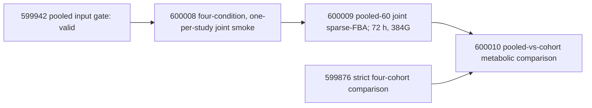

# HGSOC CORNETO 研究状态与依赖登记（中文对应版）

最后运行更新：2026-08-12 12:22 BST（15:22 EEST）。本文件与
`docs/hgsoc_corneto_research_status.md` 对应，记录研究范围、已完成证据、排队分析、失败尝试、依赖关系与可声明范围。
仅有 Slurm `COMPLETED` 不足以证明科学分析完成；只有输出 `receipt` 通过相应内容验证后，结果才算科学上完成。

## 核心科学问题（Central scientific question）

> HGSOC OCM 中是否存在跨 cohort 可复现、对重复患者和 modelling choices
> 稳健的 metabolic 与 regulatory states；这些状态相对于 stroma/reference
> samples 是否富集，并能否得到外部 mechanistic evidence 支持？

主要证据单位是 60 个 primary HGSOC tumour OCM。它们来自 52 位患者和四个
study，因此所有分析都必须区分 OCM-level、patient-balanced、cohort-stratified
和 pooled 结果。其余公开 RNA runs 是 reference/QC 数据，不得静默合并进 primary cohort。

## 冻结的样本范围（Frozen sample universe）

| Study | 全部 RNA runs | Primary HGSOC tumour OCM | 主要 reference runs |
|---|---:|---:|---|
| E-MTAB-7223 | 36 | 9 | 16 stroma、2 cell-line controls、non-HGSOC/ambiguous 及其他排除项 |
| E-MTAB-10801 | 36 | 13 | 17 stroma、6 non-HGSOC |
| E-MTAB-11000 | 12 | 11 | 1 个 non-primary tumour run |
| E-MTAB-14568 | 33 | 27 | 6 non-HGSOC |
| **合计** | **117** | **60 OCM / 52 patients** | **57 reference/excluded runs** |

reference categories 具有不同科学角色，必须分开分析：stroma 是最强的正式
secondary contrast；confirmed non-HGSOC 是 exploratory histology contrast；
ambiguous samples 不是 controls；两个 cell-line controls 只能用于 descriptive
QC；later-passage 与 non-Tighe samples 用于 stability 或 response-blind replication，
不能用于 population-level inference。

## 分析层级与 claim limits

| Evidence tier | 分析 | 允许的解释 |
|---|---|---|
| Primary | 四个 cohort-specific primary-HGSOC metabolic/regulatory models；cross-cohort recurrence | 可复现的 model-predicted metabolic/regulatory state |
| Robustness | pooled-60、patient-balanced-52、lambda、PKN、NMF rank、alternative optima | 对 modelling choices 和重复患者的敏感性 |
| Reference | tumour vs stroma；confirmed HGSOC vs confirmed non-HGSOC；cell-line/passage QC | enrichment/shared core，不能声称 absolute presence/absence |
| Mechanistic | Meeson/TPI1、WT vs delta-TPI1、FVA、order sensitivity | 与模型/已知机制的一致性，不是 drug-response validation |
| Phenotype-linked | exact AUC、raw GI50、cumulative exposure、grouped CV | **在 exact phenotype tables 通过 intake QC 前保持 blocked** |

所有 expression-derived flux 都是模型预测的 feasible flux states，不是 measured
flux。由同一 RNA profiles 得到的 regulatory/NMF/metabolic agreement 是 internal
consistency，不是 independent validation。

## 已完成且可审计的结果（Completed and auditable results）

### RNA 与 pooled-input gates

- 四个 RNA studies 均已下载、定量并聚合，且通过严格 run/receipt 检查。
- Pooled primary expression 包含 60 runs、60 OCM、52 patients 和 60,609 genes；
  study counts 为 9/13/11/27。
- Pooled metabolic input gate job **599942** 已完成，验证 matrix、manifest、
  Human-GEM 和全部 SHA256 provenance。Receipt：
  `data/processed/corneto/pooled_primary_60/metabolic_input_gate.json`。

### NMF

- Primary cohort 与 pooled NMF jobs **591326-591328** 已完成。
- Pooled rank-3 clusters 包含 23/20/17 samples；cophenetic correlation 为
  0.939，silhouette 为 0.770。Rank 2 更稳定（0.972/0.899），因此 rank 3
  是冻结的 comparability benchmark，不是唯一最优 rank。
- Pooled-vs-cohort rank-3 ARI：7223 为 0.723、10801 为 0.529、11000 为
  0.377、14568 为 0.569；mapped assignment agreement 为 0.889/0.846/0.727/0.741。
- pooled state 与 study 的关联未达到清晰统计证据（chi-square p=0.207、
  Cramer's V=0.265），但仍需要 study-aware sensitivity。
- Patient-balanced-52 rank-3 comparison 已完成：mapped agreement 0.942、
  ARI 0.842、NMI 0.825。这支持对 repeated-patient weighting 的稳健性，但仅是一次 deterministic patient-balanced selection。

### Regulatory CORNETO

- True multi-condition normalized-lambda grid 与 retries 已完成；final summary
  包含九个 nominal lambdas 下的 45/45 pooled/cohort receipts。
- Patient-balanced regulatory analysis 在 52 个共同患者上保留了相似网络：
  pooled/balanced union Jaccard 为 0.890，mean per-sample Jaccard 为 0.899。
- Narrow-vs-richer PKN sensitivity 已完成。Pooled union Jaccard 为 0.202，
  mean sample Jaccard 为 0.108；cohort union Jaccard 约为 0.108-0.143。因此
  network conclusions 明显受 PKN 影响，必须报告 stable cores 与 uncertain alternatives。
- Regulatory longitudinal summary 覆盖 60 runs 和八个 within-family transitions。
  这是 response-blind 分析；acquired-resistance 解释仍需 exact exposure 和 phenotype。
- Regulatory x NMF state integration 已覆盖四个 cohorts。它是基于相同 input 的
  descriptive integration，不是 independent validation，也不是 subtype discovery。
- E-MTAB-14568 regulatory alternative-optima ensemble 与 serial repairs 已完成。
  正确的证据对象是 solution ensemble，而不是单个 sparse optimum。

### Human-GEM 与 TPI1 model gate

- Public Meeson TPI1 table audit job **591424** 已完成；它审计 published/model
  values，不是 OCM-specific knockout result。
- Independent model-level TPI1 gate job **599873** 已完成且有效：Human-GEM
  含 13,096 reactions 和 3,628 genes；TPI1 映射到 `ENSG00000111669` 与 reaction
  `HMR_4391`；没有调用 solver。Receipt：
  `data/processed/corneto/tpi1_model_gate.json`。
- 过时的 pending job **591049** 在启动前已取消，因为它会在 original baselines
  之后覆盖同一 receipt。其职责现已拆分为 599873（model only）和 599950（strict
  receipt-dependent preflight）。

## Metabolic baseline：运行中、失败与排队任务

冻结的 primary settings：Human-GEM v1.4.1、raw TPM 经 `log1p` 转换、primary
tumour only、candidate budget 25、growth fraction 0.9、independent lambda 0.1、
joint lambda 1.0，以及不允许 fallback 的 explicit Gurobi。

| Study | Original job | 当前状态 | Conditional/new retry | Resources |
|---|---:|---|---:|---|
| E-MTAB-7223 | 588250 | 运行 20 h 44 min；24 h limit 约剩 3 h 16 min | **600005**，afterany:588250；若已有 receipt 验证有效则跳过 | 72 h、128G、8 CPU |
| E-MTAB-10801 | 588251 | 失败：确认为 64G OOM | **600004**，运行 4 h 42 min，未见 startup error 或 receipt | 72 h、196G、8 CPU |
| E-MTAB-11000 | 588252 | 运行 20 h 44 min；24 h limit 约剩 3 h 16 min | **600006**，afterany:588252；若已有 receipt 验证有效则跳过 | 72 h、128G、8 CPU |
| E-MTAB-14568 | 588253 | 运行 20 h 44 min；72 h limit 约剩 51 h 16 min | **600007**，afterany:588253；若已有 receipt 验证有效则跳过 | 72 h、196G、8 CPU |

15:22 EEST 检查显示，588250/588252/588253 active steps 的 peak RSS 约为
22.6/24.4/27.5 GiB；196G 的 10801 retry 600004 约为 11.8 GiB，pooled
smoke 600008 约为 4.0 GiB。所有 per-OCM biomass-optimum LP 已完成，但 runner
没有记录静默进行的是 independent MILP 还是最终 cohort-joint MILP。尚无 final
metabolic receipt。两个 24-hour jobs 仍健康但接近限时；只允许使用已有的 afterany retries 继续。

已取代的 startup attempts **599836** 和 **599943** 在数秒内以 exit 127 失败，
原因是 direct non-login sbatch scripts 中没有 `module`；它们没有调用 Gurobi，也没有
产生科学输出。坏的 pending retries 599837-599839 在启动前已取消，并由 600005-600007 替代。

Immediate availability audit **599874** 已完成，状态为 `incomplete`，正确记录
0/4 final receipts；这是预期状态，不是 scientific failure。Final availability audit
**599875** 与 strict four-cohort comparison **599876** 等待 600004-600007 终态。
若任何 receipt 缺失或不符合 frozen contract，strict comparison 会 fail closed。

## Pooled metabolic joint analysis

该分析有意只做 joint-only：四个 cohort jobs 提供 independent/cohort evidence；
不在一个 72 小时 pooled job 中重复 60 个 independent MILPs，以免重复计算并在超时后丢失进度。

Smoke 使用每个 study 一个 primary OCM，candidate budget 25、growth fraction 0.9、
joint lambda 1.0 和 Gurobi。只有 smoke 成功后 pooled-60 job 才会启动，但二者都不依赖
cohort baselines。15:22 EEST checkpoint 时，smoke job **600008** 已运行 4 h 42 min，
持续加载/求解预期的 Human-GEM LP，未见 scheduler、timeout、OOM、license-session-cap
或 receipt error。Pooled full job **600009** 与 comparator **600010** 仍按设计等待 receipt-producing predecessors。

## TPI1/FVA 与 Meeson dependency chain

现有 Meeson order-sensitivity 与 ensemble jobs 绑定在各个 original cohort jobs 上。
如果 original job timeout 但 conditional retry 成功，对应的 cancelled downstream
task 必须改为依赖有效 retry receipt 后重新提交。不能仅依据 dependency state 推断结果。

## 仍需实现/运行的 reference comparisons

1. **Tumour vs stroma（正式 secondary analysis）。** 分别分析 E-MTAB-7223 与
   E-MTAB-10801；身份允许时使用 paired contrasts，然后 meta-analyse prevalence/effect
   sizes。报告 tumour-enriched、stroma-enriched、shared stable core、study-specific
   与 unresolved features。
2. **HGSOC vs confirmed non-HGSOC（exploratory）。** 先确认 histology；ambiguous
   samples 仍保持独立类别。
3. **Tumour vs 两个 cell-line controls（descriptive QC）。** 不应作 population-level
   p-values 或 population-level claims。
4. **Passage/non-Tighe stability。** 使用 paired/case-level expression、NMF、regulatory
   与 metabolic retention；不要附加 drug-response labels。
5. 所有 network contrast 都应以 prevalence difference、patient/study-aware uncertainty、
   alternative-optima frequency、lambda/PKN sensitivity 与 multiplicity control 代替简单 set subtraction。

## 缺少的数据与 blocked claims

目前尚未获得通过验证的 intake table，其中包含 exact OCM-linked AUC、raw GI50 units、
cumulative treatment exposure 及其 primary provenance。在通过 frozen phenotype gate 之前，
项目不能声称 Taxol response、intrinsic resistance、acquired resistance prediction 或
response-model accuracy。`chemo_naive_at_biopsy` 不能替代 exact cumulative exposure。

## Operational update rules

1. 保留失败 logs 与 receipts；retry 只有在 canonical result 缺失时写入，已有 receipt 必须先验证后才能跳过。
2. Audit jobs 使用 `afterany`，确保失败可见；scientific downstream jobs 使用 `afterok` 加内部 receipt validation。
3. 每个 receipt 记录 job ID、exact command、model/input hashes、sample contract、solver、
   lambda、candidate budget、objective 与 claim limit。
4. 不得根据最有吸引力的 biological story 选择 lambda、NMF rank、PKN 或 candidate budget；
   primary settings 与 sensitivity grids 必须在 outcome analysis 前冻结。
5. 任何任务进入终态或 validated receipt 改变 evidence state 时，都要更新本登记。

## 定时监控（Recurring monitor）

Codex heartbeat **HGSOC CORNETO Roihu pipeline monitor** 已绑定到当前对话，
每 30 分钟运行一次；它没有显式 model 或 reasoning override，因此遵循当前对话/默认设置，
不会创建单独的 standalone monitoring conversation。这个时间间隔的理由是：

- Slurm dependencies 会自动启动有效 successors，因此分钟级轮询不会加速 pipeline。
- 30 分钟足以在 588250/588252 接近 24-hour limits 时发现 smoke/startup、license-session、
  timeout 与 receipt failures。
- 对 branch-and-bound 中日志很少的 multi-hour Gurobi jobs，30 分钟不会造成无效的高频查询。

每次运行都检查 scheduler state、resource use、log tails 与 receipt JSON。它只能执行确定且
属于当前范围的修复：不重复提交、不取消健康任务、不改变 scientific parameters，也不在没有
有效 receipt 时作结果声明。OOM/TIMEOUT retry 保留参数并只增加有依据的 resources；Gurobi
session-cap failure 要等 active sessions 少于 8 后再低并发或串行 retry。有实质变化时更新本文件
并 push 到 delivery branch；无变化时只报告简短 checkpoint。所有 cohort、pooled、comparison
与 TPI1/FVA outputs 进入终态并完成 audit 后，monitor 应报告完成并暂停。
